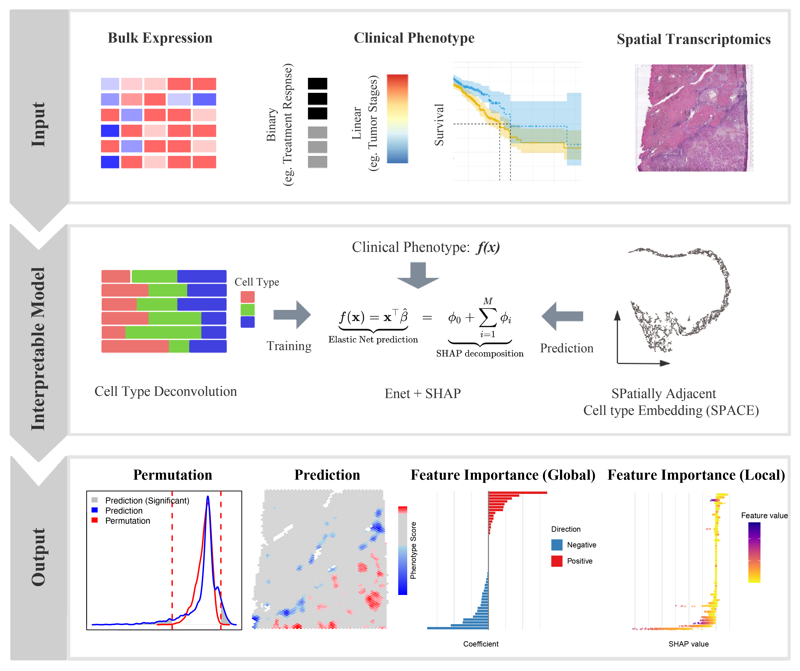

<!-- README.md is generated from README.Rmd. Please edit that file -->

# SpaPheno: Linking Spatial Transcriptomics to Clinical Phenotypes with Interpretable Machine Learning

```{r, echo=FALSE, results="hide", message=FALSE}
Biocpkg <- function (pkg) {
    sprintf("[%s](http://bioconductor.org/packages/%s)", pkg, pkg)
}
library(conflicted)
conflicted::conflict_prefer("filter", "dplyr")

knitr::opts_chunk$set(fig.path = "inst/figures/README-")
```

## Overview

**SpaPheno** is an R package designed to identify, visualize, and interpret spatial phenotype associations from spatial transcriptomics and simulated bulk data. Linking spatial transcriptomic patterns to clinical phenotypes is essential for advancing precision oncology. We introduce SpaPheno, an interpretable machine learning framework that bridges spatial transcriptomic data with clinically annotated bulk RNA-seq datasets. SpaPheno integrates Elastic Net regression with SHAP-based interpretation to identify spatially localized features—such as cell types and tissue regions—that are predictive of patient survival, tumor stage, and immunotherapy response. Through comprehensive simulations and applications to spatial datasets from primary liver cancer, kidney renal clear cell carcinoma (KIRC), breast cancer (BRCA), and melanoma, SpaPheno demonstrates superior performance and broad applicability. By jointly optimizing predictive power and biological interpretability, SpaPheno enables the discovery of clinically meaningful spatial biomarkers, offering a generalizable approach for spatially informed precision medicine.

```{r, echo=FALSE, out.width="80%", out.height="80%", dpi=600, fig.align="center", fig.cap="The Overview of SpaPheno"}

```

## :sunny: Key Features

- **Construct predictive models** from cell type compositions and phenotypic labels (e.g., disease presence).
- **Map spatial risk distributions** across tissues or organs using spatially-aware neighborhood features.
- **Assess statistical significance** through permutation-based tests.
- **Interpret feature contributions** using SHAP (SHapley Additive exPlanations) analysis at single-cell resolution.

## :arrow_double_down: Installation

```r
if (!require("BiocManager", quietly = TRUE)) {
  install.packages("BiocManager")
}

## Install suggested packages
# BiocManager::install(c(
#   "glmnet",
#   "FNN",
#   "survival"
# ))

# install.packages("devtools")
# devtools::install_github("bm2-lab/SpaDo")

# SpaPheno installation
# devtools::install_github("DuanLab1/SpaPheno", dependencies = c("Depends", "Imports", "LinkingTo"))

library(SpaPheno)
library(tidyverse)
library(ggplot2)
library(reshape2)
library(stringr)
library(survival)
```

## 🚀 Quick Start


### Data availability

The data required for the test are all listed in the following google cloud directory [SpaPheno Demo Data](https://drive.google.com/drive/folders/1tiSgMjhzvIsirvJwFDIAQIEIhR7qixUW?usp=drive_link).

```
├── BRCAsurvival.RData
├── HCC_stage.RData
├── HCC_survival.RData
├── KIRC_survival.RData
├── Melanoma_ICB.RData
├── Simulation_osmFISH.RData
└── Simulation_STARmap.RData
```

## :book: Vignette

Using the following command and Choosing the `html` for more details.

```r
utils::browseVignettes(package = "SpaPheno")
```

## :sparkling_heart: Contributing

Welcome any contributions or comments, and you can file them
[here](https://github.com/DuanLab1/SpaPheno/issues).

## :trophy: Acknowledgement

Thanks all the developers of the methods integrated into **SpaPheno**. 

## :eight_pointed_black_star: Citation

Kindly cite by using `citation("SpaPheno")` if you think **SpaPheno** helps you. Alternative way is Bin Duan (2025).
*SpaPheno: Spatially-Informed Phenotype Prediction and Interpretation Using Single-Cell Data*. R package version 0.0.1,
\<URL:<https://github.com/DuanLab1/SpaPheno/>\>.

## :writing_hand: Authors

+ [Bin Duan](mailto:binduan@sjtu.edu.cn)
