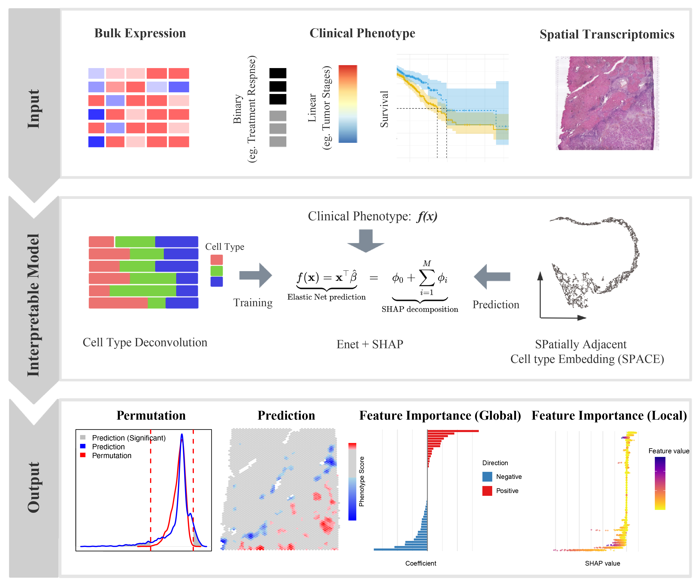

<!-- README.md is generated from README.Rmd. Please edit that file -->

# SpaPheno: Linking Spatial Transcriptomics to Clinical Phenotypes with Interpretable Machine Learning

## Overview

**SpaPheno** is an R package designed to identify, visualize, and
interpret spatial phenotype associations from spatial transcriptomics
and simulated bulk data.

Linking spatial transcriptomic patterns to clinically relevant
phenotypes is a critical step toward spatially informed precision
oncology. Here, we introduce SpaPheno, an interpretable machine learning
framework that integrates spatial transcriptomics with clinically
annotated bulk RNA-seq data to uncover spatially resolved biomarkers
predictive of patient outcomes. Leveraging Elastic Net regression
combined with SHAP-based attribution, SpaPheno uniquely identifies
spatial features at multiple scales—from tissue regions to specific cell
types and individual spatial spots—that are associated with patient
survival, tumor stage, and immunotherapy response. We demonstrate the
robustness and generalizability of SpaPheno through comprehensive
simulations and applications spanning primary liver cancer, clear cell
renal cell carcinoma, breast cancer, and melanoma. Across these diverse
settings, SpaPheno achieves high predictive accuracy while providing
biologically meaningful and spatially precise interpretations. Our
framework offers a powerful and extensible approach for translating
complex spatial omics data into actionable clinical insights,
accelerating the development of precision oncology strategies grounded
in tumor spatial architecture.

<div class="figure" style="text-align: center">


<p class="caption">

The Overview of SpaPheno
</p>

</div>

## :sunny: Key Features

- **Integration of spatial transcriptomics with clinically annotated
  bulk RNA-seq data**

- **Multi-scale interpretable machine learning framework**

- **Robust applicability across diverse cancer types and clinical
  endpoints**

## :arrow_double_down: Installation

``` r
if (!require("BiocManager", quietly = TRUE)) {
  install.packages("BiocManager")
}

## Install suggested packages
# BiocManager::install(c(
#   "glmnet",
#   "FNN",
#   "survival"
# ))

# install.packages("devtools")
# devtools::install_github("bm2-lab/SpaDo")

# SpaPheno installation
# devtools::install_github("Duan-Lab1/SpaPheno", dependencies = c("Depends", "Imports", "LinkingTo"))

library(SpaPheno)
library(tidyverse)
library(ggplot2)
library(reshape2)
library(stringr)
library(survival)
```

## 🚀 Quick Start

### Data availability

The data required for the test are all listed in the following google
cloud directory [SpaPheno Demo
Data](https://drive.google.com/drive/folders/1tiSgMjhzvIsirvJwFDIAQIEIhR7qixUW?usp=drive_link).

    ├── BRCAsurvival.RData
    ├── HCC_stage.RData
    ├── HCC_survival.RData
    ├── KIRC_survival.RData
    ├── Melanoma_ICB.RData
    ├── Simulation_osmFISH.RData
    └── Simulation_STARmap.RData

## :book: Vignette

Using the following command and Choosing the `html` for more details.

``` r
utils::browseVignettes(package = "SpaPheno")
```

## :sparkling_heart: Contributing

Welcome any contributions or comments, and you can file them
[here](https://github.com/Duan-Lab1/SpaPhenoissues).

## :trophy: Acknowledgement

Thanks all the developers of the methods integrated into **SpaPheno**.

## :eight_pointed_black_star: Citation

Kindly cite by using `citation("SpaPheno")` if you think **SpaPheno**
helps you. Alternative way is Bin Duan (2025). *SpaPheno: Linking
Spatial Transcriptomics to Clinical Phenotypes with Interpretable
Machine Learning*. R package version 0.0.1,
\<URL:<https://github.com/Duan-Lab1/SpaPheno>\>.

## :writing_hand: Authors

- [Bin Duan](mailto:binduan@sjtu.edu.cn)

- [Hua Zou](mailto:zouhua1@outlook.com)
