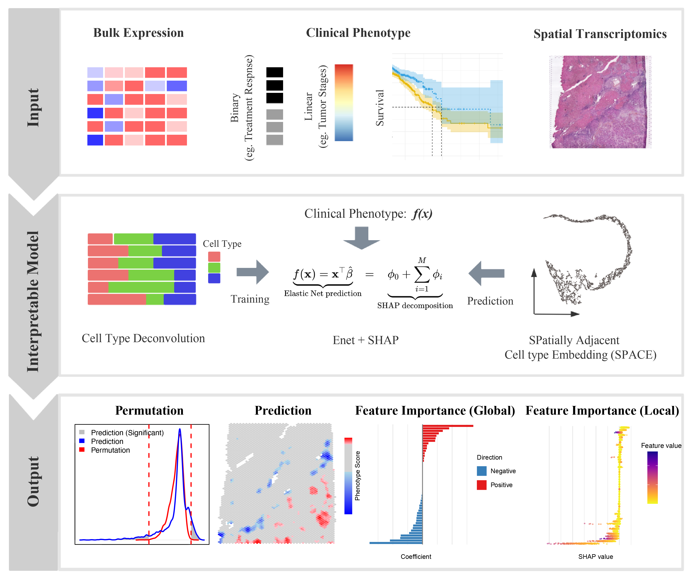

<!-- README.md is generated from README.Rmd. Please edit that file -->

# SpaPheno: Linking Spatial Transcriptomics to Clinical Phenotypes with Interpretable Machine Learning

## Overview

Linking spatial transcriptomic patterns to clinically relevant
phenotypes is a critical step toward spatially informed precision
oncology. Here, we introduce SpaPheno, an interpretable machine learning
framework that integrates spatial transcriptomics with clinically
annotated bulk RNA-seq data to uncover spatially resolved biomarkers
predictive of patient outcomes. Leveraging Elastic Net regression
combined with SHAP-based attribution, SpaPheno uniquely identifies
spatial features at multiple scales—from tissue regions to specific cell
types and individual spatial spots—that are associated with patient
survival, tumor stage, and immunotherapy response. We demonstrate the
robustness and generalizability of SpaPheno through comprehensive
simulations and applications spanning primary liver cancer, clear cell
renal cell carcinoma, breast cancer, and melanoma. Across these diverse
settings, SpaPheno achieves high predictive accuracy while providing
biologically meaningful and spatially precise interpretations. Our
framework offers a powerful and extensible approach for translating
complex spatial omics data into actionable clinical insights,
accelerating the development of precision oncology strategies grounded
in tumor spatial architecture.

<div class="figure" style="text-align: center">


<p class="caption">

The Overview of SpaPheno
</p>

</div>

## :sunny: Key Features

- **Integration of spatial transcriptomics with clinically annotated
  bulk RNA-seq data**

- **Multi-scale interpretable machine learning framework**

- **Robust applicability across diverse cancer types and clinical
  endpoints**

## :arrow_double_down: Installation

``` r
if (!require("BiocManager", quietly = TRUE)) {
  install.packages("BiocManager")
}

## Install suggested packages
# BiocManager::install(c(
#   "glmnet",
#   "FNN",
#   "survival"
# ))

# install.packages("devtools")
# devtools::install_github("bm2-lab/SpaDo")

# SpaPheno installation
# devtools::install_github("Duan-Lab1/SpaPheno", dependencies = c("Depends", "Imports", "LinkingTo"))

library(SpaPheno)
library(tidyverse)
library(ggplot2)
library(reshape2)
library(stringr)
library(survival)
```

Download the pre-packaged installation package directly from the [GitHub
repository](https://github.com/Duan-Lab1/SpaPheno/releases)

``` r
install.packages("SpaPheno_0.0.1.tar.gz", repos = NULL, type = "source")
```

## 🚀 Quick Start

### Data availability

The data required for the test are all listed in the following google
cloud directory [SpaPheno Demo
Data](https://drive.google.com/drive/folders/1tiSgMjhzvIsirvJwFDIAQIEIhR7qixUW?usp=drive_link).

    ├── BRCAsurvival.RData
    ├── HCC_stage.RData
    ├── HCC_survival.RData
    ├── KIRC_survival.RData
    ├── Melanoma_ICB.RData
    ├── Simulation_osmFISH.RData
    └── Simulation_STARmap.RData

In addition to the demonstration datasets above, we provide standardized
pan-cancer bulk and single-cell reference resources to support
cross-cohort and multi-omic applications of SpaPheno [SpaPheno
TCGA-scRNARef-Dataset](https://drive.google.com/drive/folders/1g8Uj1bSprGMGG0Qitl5TMXVnEr6f3Ix0):

| No. | TCGA Standard Cancer Type | Corresponding Single-Cell Data Original Naming |
|:--:|:---|:---|
| 1 | BLCA | BLCA |
| 2 | BRCA | BRCA / Breast |
| 3 | CESC | CESC |
| 4 | CHOL | CHOL |
| 5 | COAD | CRC |
| 6 | ESCA | ESCA |
| 7 | HNSC | HNSC / HNSCC / Oral |
| 8 | KICH | KICH |
| 9 | KIRC | KIRC |
| 10 | LIHC | LIHC / Liver |
| 11 | LUAD | LUAD |
| 12 | LUSC | LSCC |
| 13 | OV | OV / Ovary |
| 14 | PAAD | PAAD |
| 15 | PRAD | PRAD |
| 16 | SKCM | SKCM |
| 17 | STAD | STAD |
| 18 | THCA | THCA |
| 19 | UCEC | UCEC |
| 20 | UVM | UVM |

- **TCGA Pan-Cancer Bulk Expression and Clinical Data**:

Processed RNA-seq gene expression profiles (raw counts) and
corresponding clinical annotations (including survival outcomes, tumor
stage) for **20 common cancer types** from The Cancer Genome Atlas
(TCGA) are available. The included cancer types are listed in the table
below, with unified gene symbols and standardized phenotype annotations
to facilitate direct use with SpaPheno:

    TCGA-n20PanCaner_Dataset
    ├── TCGA-BLCA
    │   ├── BLCA_summary.csv
    │   ├── BLCA_expression_by_gene_name.tsv
    │   ├── BLCA_expression.tsv
    │   ├── BLCA_phenotype_with_survival.csv
    │   └── BLCA_phenotype.csv
    ├── TCGA-BRCA
    ├── TCGA-CESC
    ├── TCGA-CHOL
    ├── TCGA-COAD
    ├── TCGA-ESCA
    ├── TCGA-HNSC
    ├── TCGA-KICH
    ├── TCGA-KIRC
    ├── TCGA-LIHC
    ├── TCGA-LUAD
    ├── TCGA-LUSC
    ├── TCGA-OV
    ├── TCGA-PAAD
    ├── TCGA-PRAD
    ├── TCGA-SKCM
    ├── TCGA-STAD
    ├── TCGA-THCA
    ├── TCGA-UCEC
    └── TCGA-UVM

- **TabulaTIME Single-Cell Reference Data**:

Matched single-cell RNA-seq reference datasets for the above cancer
types, derived from the TabulaTIME database, are provided as
preprocessed `Seurat` objects. These datasets include cell type
annotations, enabling direct integration with spatial transcriptomics
data for cell type deconvolution and spatially resolved interpretation
in SpaPheno.

    TabulaTIME_scRNA_ref/
    ├── TabulaTIME_reference_summary.csv
    ├── BLCA_ref.rds
    ├── BRCA_ref.rds
    ├── CESC_ref.rds
    ├── CHOL_ref.rds
    ├── CRC-COAD_ref.rds
    ├── ESCA_ref.rds
    ├── HNSC_ref.rds
    ├── KICH_ref.rds
    ├── KIRC_ref.rds
    ├── LIHC_ref.rds
    ├── LSCC-LUSC_ref.rds
    ├── LUAD_ref.rds
    ├── OV_ref.rds
    ├── PAAD_ref.rds
    ├── PRAD_ref.rds
    ├── SKCM_ref.rds
    ├── STAD_ref.rds
    ├── THCA_ref.rds
    ├── UCEC_ref.rds
    └── UVM_ref.rds

### Deconvolution Strategy

To enable consistent and comparable phenotype association analysis
across data types, SpaPheno performs **cell-type deconvolution** on both
bulk RNA-seq and spatial transcriptomics (ST) data using a shared
single-cell RNA-seq reference dataset.

In the current implementation, **cell2location** is used to estimate
cell-type abundance profiles, ensuring that downstream phenotype
modeling is built on unified, biologically interpretable features.

> ### Parameter Selection for cell2location
>
> When performing deconvolution with cell2location, two key parameters
> should be carefully adjusted based on the input data modality:
>
> #### 1. N_cells_per_location
>
> This parameter specifies the expected number of cells contributing to
> each measured profile.
>
> - **Spatial transcriptomics (e.g., 10x Visium)**
>
>   Each spot captures a mixture of multiple cells.
>
>   A reasonable range is:
>
>   `N_cells_per_location = 10–30`
>
>   Default setting in SpaPheno:
>
>   `N_cells_per_location = 20`
>
> - **Bulk RNA-seq**
>
>   Each sample represents a large aggregate of cells.
>
>   Following cell2location recommendations, a moderate-to-large value
>   is used:
>
>   `N_cells_per_location = 1–100`
>
>   Default setting in SpaPheno:
>
>   `N_cells_per_location = 100`
>
> #### 2. detection_alpha
>
> This parameter controls regularization strength for per-sample
> normalization, accounting for technical variation in RNA detection
> efficiency.
>
> - **Lower values (e.g., 20)**
>
>   → Stronger normalization and adaptation to technical noise
>
>   → More suitable for **spatial transcriptomics**, which typically
>   exhibits higher technical heterogeneity
>
> - **Higher values (e.g., 200)**
>
>   → Weaker normalization, assuming more stable detection sensitivity
>
>   → More suitable for **bulk RNA-seq**, where technical variation is
>   relatively modest
>
> Default settings used in SpaPheno:
>
> - Visium spatial transcriptomics: `detection_alpha = 20`
> - Bulk RNA-seq: `detection_alpha = 200`
>
> ### Practical Recommendations
>
> Parameter choice should reflect both biological structure and
> technical characteristics:
>
> - **Spot-based spatial data**
>
>   → Use relatively low `N_cells_per_location`
>
>   → Use moderate or low `detection_alpha`
>
> - **Bulk or bulk-like profiling data**
>
>   → Use higher `N_cells_per_location`
>
>   → Use higher `detection_alpha`

### Tutorial

For more information and documentation, please visit the **[SpaPheno
website](https://duan-lab1.github.io/SpaPheno/)**.

## :book: Vignette

Using the following command and Choosing the `html` for more details.

``` r
utils::browseVignettes(package = "SpaPheno")
```

## :sparkling_heart: Contributing

Welcome any contributions or comments, and you can file them
[here](https://github.com/Duan-Lab1/SpaPhenoissues).

## :trophy: Acknowledgement

Thanks all the developers of the methods integrated into **SpaPheno**.

## :eight_pointed_black_star: Citation

Kindly cite by using `citation("SpaPheno")` if you think **SpaPheno**
helps you. Alternative way is **Duan, B., Cheng, X. & Zou, H. SpaPheno:
linking spatial transcriptomics to clinical phenotypes with
interpretable machine learning. Genome Med (2026).
<https://doi.org/10.1186/s13073-026-01645-7>**

## :writing_hand: Authors

- [Bin Duan](mailto:binduan@sjtu.edu.cn)

- [Hua Zou](mailto:zouhua1@outlook.com)
