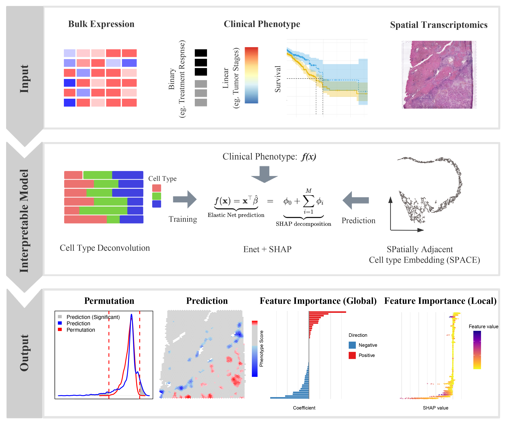

```{r setup, include=FALSE}
knitr::opts_chunk$set(
  echo = TRUE,
  warning = FALSE,
  message = FALSE,
  fig.align = "center",
  cache = TRUE
)
library(BiocStyle)
```


## Introduction

**SpaPheno** is an R package designed to identify, visualize, and interpret spatial phenotype associations from spatial transcriptomics and simulated bulk data. Linking spatial transcriptomic patterns to clinical phenotypes is essential for advancing precision oncology. We introduce SpaPheno, an interpretable machine learning framework that bridges spatial transcriptomic data with clinically annotated bulk RNA-seq datasets. SpaPheno integrates Elastic Net regression with SHAP-based interpretation to identify spatially localized features—such as cell types and tissue regions—that are predictive of patient survival, tumor stage, and immunotherapy response. Through comprehensive simulations and applications to spatial datasets from primary liver cancer, kidney renal clear cell carcinoma (KIRC), breast cancer (BRCA), and melanoma, SpaPheno demonstrates superior performance and broad applicability. By jointly optimizing predictive power and biological interpretability, SpaPheno enables the discovery of clinically meaningful spatial biomarkers, offering a generalizable approach for spatially informed precision medicine.

- **Construct predictive models** from cell type compositions and phenotypic labels (e.g., disease presence).
- **Map spatial risk distributions** across tissues or organs using spatially-aware neighborhood features.
- **Assess statistical significance** through permutation-based tests.
- **Interpret feature contributions** using SHAP (SHapley Additive exPlanations) analysis at single-cell resolution.

```{r, echo=FALSE, out.width="80%", out.height="80%", dpi=600, fig.align="center", fig.cap="The Overview of SpaPheno"}

```

## Installation

To get started with **SpaPheno**, ensure that you have the required dependencies installed. The package relies on a set of CRAN and Bioconductor packages such as glmnet, FNN, and survival. You can install them via BiocManager if not already available.

Next, install **SpaPheno** directly from GitHub using devtools. This will fetch the latest development version maintained by the authors.

Once installed, load the core packages used throughout the SpaPheno workflow, including ggplot2 for visualization and tidyverse for data handling.

```{r}
if (!require("BiocManager", quietly = TRUE)) {
  install.packages("BiocManager")
}

## Install suggested packages
# BiocManager::install(c(
#   "glmnet",
#   "FNN",
#   "survival"
# ))

# install.packages("devtools")
# devtools::install_github("bm2-lab/SpaDo")

# SpaPheno installation
# devtools::install_github("DuanLab1/SpaPheno", dependencies = c("Depends", "Imports", "LinkingTo"))

library(SpaPheno)
library(tidyverse)
library(ggplot2)
library(reshape2)
library(stringr)
library(survival)
```


## Data availability

The data required for the test are all listed in the following google cloud directory [SpaPheno Demo Data](https://drive.google.com/drive/folders/1tiSgMjhzvIsirvJwFDIAQIEIhR7qixUW?usp=drive_link).

```
├── BRCAsurvival.RData
├── HCC_stage.RData
├── HCC_survival.RData
├── KIRC_survival.RData
├── Melanoma_ICB.RData
├── Simulation_osmFISH.RData
└── Simulation_STARmap.RData
```

## Simulation osmFISH

This tutorial demonstrates the workflow of **SpaPheno** using simulated osmFISH data, including:

1. Loading and visualizing spatial cell annotations.
2. Defining simulated phenotypes across spatial regions.
3. Generating pseudo-bulk samples for phenotype modeling.
4. Building a logistic regression model via automated regularization selection.
5. Performing spatial phenotype risk prediction.
6. Interpreting key contributing cell types using SHAP values.
7. Exploring spatial patterns of model residuals for biological insight.

Together, this pipeline allows researchers to integrate spatial structure, cell composition, and predictive modeling to understand how local cell-type environments contribute to complex phenotypes.

### load data

```{r}
rm(list = ls())

load(system.file("extdata", "Simulation_osmFISH.RData", package = "SpaPheno"))

ggplot(test_coordinate, aes(x = X, y = Y, color = sample_information_cellType)) +
  geom_point(size = 1)
ggplot(test_coordinate, aes(x = X, y = Y, color = sample_information_region)) +
  geom_point(size = 1)
```

### Choose simulated phenotypes

```{r}
region_all <- names(table(sample_information_region))
phenotype_simu <- region_all[c(3, 4)]
sample_information_region_choose <- sample_information_region
sample_information_region_choose[!sample_information_region_choose %in% phenotype_simu] <- NA
```

### Ground truth of simulated phenotypes

```{r}
custom_colors <- c("red", "lightgray", "blue")
names(custom_colors) <- c(phenotype_simu[2], "Background", phenotype_simu[1])
sample_information_region_choose[!sample_information_region_choose %in% phenotype_simu] <- "Background"
Ground_truth <- factor(sample_information_region_choose[row.names(test_coordinate)], levels = c(phenotype_simu[1], "Background", phenotype_simu[2]))
ggplot(test_coordinate, aes(x = X, y = Y, color = Ground_truth)) +
  geom_point(size = 1) +
  scale_color_manual(values = custom_colors)
```

### Simulating bulk data with phenotypes

```{r}
pseudo_bulk_simi <- generate_simulated_bulk_data(
  input_data = sample_information_cellType, 
  region_labels = sample_information_region, 
  phenotypes = phenotype_simu, 
  perturbation_percent = 0.1, 
  num_samples = 50, 
  mode = "proportion")

pseudo_bulk_df1 <- pseudo_bulk_simi[[1]]
pseudo_bulk_df2 <- pseudo_bulk_simi[[2]]

bulk_decon <- t(as.matrix(cbind(pseudo_bulk_df1, pseudo_bulk_df2)))
bulk_pheno <- rep(c(0, 1), each = 50)
names(bulk_pheno) <- c(colnames(pseudo_bulk_df1), colnames(pseudo_bulk_df2))
family <- "binomial"
```

### Obtaining prediction results

```{r}
PhenoResult <- SpatialPhenoMap(
  bulk_decon = bulk_decon, 
  bulk_pheno = bulk_pheno, 
  family = family, 
  coord = test_coordinate, 
  resolution = "single_cell", 
  sample_information_cellType = sample_information_cellType, 
  n_perm = 1, 
  p = 0.001)
```

### SHAP analysis

```{r}
pred_result <- PhenoResult$pred_score
phenoPlus <- row.names(pred_result[pred_result$label %in% "phenotype+", ])

model <- PhenoResult$model
X <- as.data.frame(PhenoResult$cell_type_distribution[phenoPlus, ])

## This step took a very long time
# shap_test_plus <- compute_shap_spatial(
#   model = model, 
#   X_bulk = as.data.frame(bulk_decon), 
#   y_bulk = bulk_pheno, 
#   X_spatial = X)

head(shap_test_plus)
```

### SHAP summary plot

```{r}
SpaPheno_SHAP_summary_plot(shap_test_plus, top_n = 31)
```

### SHAP residual analysis

```{r}
resi_result <- SpaPheno_SHAP_residual_analysis(
  shap_df = shap_test_plus,
  feature_name = "Perivascular.Macrophages",
  coordinate_df = test_coordinate, size = 0.8
)
resi_hot <- resi_result$residual_table
head(resi_hot[order(abs(resi_hot$phi_resid_z), decreasing = T), ], 5)
SpaPheno_SHAP_waterfall_plot(shap_test_plus, "cell_5593", top_n = 10)
resi_result$dependence_plot
resi_result$spatial_plot
```


## Simulation STARmap

### load data

```{r}
rm(list = ls())

load(system.file("extdata", "Simulation_STARmap.RData", package = "SpaPheno"))

ggplot(test_coordinate, aes(x = X, y = Y, color = sample_information_cellType)) +
  geom_point()
ggplot(test_coordinate, aes(x = X, y = Y, color = sample_information_region)) +
  geom_point()
```

### Choose simulated phenotypes

```{r}
region_all <- names(table(sample_information_region))
phenotype_simu <- region_all[c(2, 6)]
sample_information_region_choose <- sample_information_region
sample_information_region_choose[!sample_information_region_choose %in% phenotype_simu] <- NA
```

### Ground truth of simulated phenotypes

```{r}
custom_colors <- c("red", "lightgray", "blue")
names(custom_colors) <- c(phenotype_simu[2], "Background", phenotype_simu[1])
sample_information_region_choose[!sample_information_region_choose %in% phenotype_simu] <- "Background"
Ground_truth <- factor(sample_information_region_choose[row.names(test_coordinate)], 
                       levels = c(phenotype_simu[1], "Background", phenotype_simu[2]))
ggplot(test_coordinate, aes(x = X, y = Y, color = Ground_truth)) +
  geom_point(size = 1) +
  scale_color_manual(values = custom_colors)
```


### Obtain simulated data with phenotypes

```{r}
pseudo_bulk_simi <- generate_simulated_bulk_data(
  input_data = sample_information_cellType, 
  region_labels = sample_information_region, 
  phenotypes = phenotype_simu, 
  perturbation_percent = 0.1, 
  num_samples = 50,
  mode = "proportion")

pseudo_bulk_df1 <- pseudo_bulk_simi[[1]]
pseudo_bulk_df2 <- pseudo_bulk_simi[[2]]

bulk_decon <- as.matrix(cbind(pseudo_bulk_df1, pseudo_bulk_df2))
bulk_decon <- t(apply(bulk_decon, 2, function(x) {
  x / sum(x)
}))
bulk_pheno <- rep(c(0, 1), each = 50)
names(bulk_pheno) <- c(colnames(pseudo_bulk_df1), colnames(pseudo_bulk_df2))
family <- "binomial"
```


### Obtain prediction results

```{r}
PhenoResult <- SpatialPhenoMap(
  bulk_decon = bulk_decon,
  bulk_pheno = bulk_pheno, 
  family = family, 
  coord = test_coordinate, 
  resolution = "single_cell", 
  sample_information_cellType = sample_information_cellType, 
  n_perm = 1, 
  p = 0.001
)
```


## Survival HCC

### load demo data

```{r}
rm(list = ls())

load(system.file("extdata", "HCC_survival.RData", package = "SpaPheno"))

### TLS label
ggplot(test_coordinate, aes(x = X, y = Y, color = sample_information_region)) +
  geom_point(size = 1.5) +
  scale_color_manual(
    values = c(
      "TLS" = "#007ACC",   
      "nonTLS" = "lightgray" 
    ),
    name = "Region Type", 
    labels = c("Non-TLS", "TLS")
  )
```

### Obtain prediction results

```{r}
PhenoResult <- SpatialPhenoMap(
  bulk_decon = bulk_decon,
  bulk_pheno = bulk_pheno,
  family = "cox",
  coord = test_coordinate,
  resolution = "spot",
  sample_information_decon = ST_decon,
  size = 1.5,
  n_perm = 1,
  p = 0.001,
  r = 4
)
```

### SHAP analysis

```{r}
pred_result <- PhenoResult$pred_score
phenoPlus <- row.names(pred_result[pred_result$label %in% "phenotype+", ])
phenoMinus <- row.names(pred_result[pred_result$label %in% "phenotype-", ])

model <- PhenoResult$model
X <- PhenoResult$cell_type_distribution[phenoMinus, ]
shap_test <- compute_shap_spatial(model, bulk_decon, bulk_pheno, X)
head(shap_test)
SpaPheno_SHAP_summary_plot(shap_test, top_n = 10)
```

### SHAP residual analysis

```{r}
resi_result <- SpaPheno_SHAP_residual_analysis(
  shap_df = shap_test,
  feature_name = "Naive.CD4T",
  coordinate_df = test_coordinate, size = 0.8
)
resi_result$dependence_plot
resi_result$spatial_plot
```

### SHAP waterfall plot

```{r}
resi_hot <- resi_result$residual_table
head(resi_hot[order(abs(resi_hot$phi_resid_z), decreasing = T), ], 10)
SpaPheno_SHAP_waterfall_plot(shap_test, "TCGCCGGAGAGTCTTA-1", top_n = 48)
```

### SHAP dependence plot

```{r}
TCell_subtypes <- unique(shap_test$feature)[str_detect(unique(shap_test$feature), "CD.T")]
BCell_subtypes <- unique(shap_test$feature)[str_detect(unique(shap_test$feature), "BCell")]
Monocyte_subtypes <- unique(shap_test$feature)[str_detect(unique(shap_test$feature), "Monocyte")]
Macrophage_subtypes <- unique(shap_test$feature)[str_detect(unique(shap_test$feature), "Macrophage")]

SpaPheno_SHAP_dependence_plot(shap_test, TCell_subtypes)
SpaPheno_SHAP_dependence_plot(shap_test, BCell_subtypes)
SpaPheno_SHAP_dependence_plot(shap_test, Monocyte_subtypes)
SpaPheno_SHAP_dependence_plot(shap_test, Macrophage_subtypes)
```


## Survival BRCA

### load demo data

```{r, echo=FALSE}
rm(list = ls())
load("../../../data/raw/BRCAsurvival.RData")
```


```r
rm(list = ls())

load("BRCAsurvival.RData")
```

```{r}
### survival phenotype
TCGA_survival_each <- TCGA_BRCA$TCGA.BRCA.survival.tsv
Survival_TCGA_choose <- as.data.frame(TCGA_survival_each)
row.names(Survival_TCGA_choose) <- Survival_TCGA_choose[, 1]

### common samples between survival phenotype and deconvolution
sample_information_decon_TCGA_choose <- BRCA_decon[intersect(as.data.frame(TCGA_survival_each)[, 1], row.names(BRCA_decon)), ]
Survival_TCGA_choose <- Survival_TCGA_choose[row.names(sample_information_decon_TCGA_choose), ]

### survival object
surv_obj <- Surv(Survival_TCGA_choose$OS.time, Survival_TCGA_choose$OS)

### ST
test_coordinate <- as.data.frame(cbind(BRCA_ST$x, BRCA_ST$y))
colnames(test_coordinate) <- c("X", "Y")
sample_information_region <- BRCA_ST$label
bulk_decon <- sample_information_decon_TCGA_choose
bulk_pheno <- surv_obj
family <- "cox"

coord <- test_coordinate
resolution <- "spot"
colnames(bulk_decon) <- gsub("^[^_]*_[^_]*_[^_]*_sf_", "", colnames(bulk_decon))
colnames(sample_information_decon) <- gsub("^[^_]*_[^_]*_[^_]*_sf_", "", colnames(sample_information_decon))
```

### Ground truth

```{r}
ggplot(test_coordinate, aes(x = X, y = Y, color = sample_information_region)) +
  geom_point(size = 4)
```

### Obtain predicion results

```{r}
PhenoResult <- SpatialPhenoMap(
  bulk_decon = bulk_decon, 
  bulk_pheno = bulk_pheno, 
  family = "cox", 
  coord = test_coordinate, 
  resolution = "spot", 
  sample_information_decon = sample_information_decon,
  size = 5, 
  n_perm = 1, 
  p = 0.001, 
  r = 2)
```


## Survival KIRC

### load demo data

```{r, echo=FALSE}
rm(list = ls())
load("../../../data/raw/KIRC_survival.RData")
```


```r
rm(list = ls())

load("KIRC_survival.RData")
```

```{r}

### survival phenotype
TCGA_survival_each <- TCGA_KIRC$TCGA.KIRC.survival.tsv
Survival_TCGA_choose <- as.data.frame(TCGA_survival_each)
row.names(Survival_TCGA_choose) <- Survival_TCGA_choose[, 1]

### common samples between survival phenotype and deconvolution
sample_information_decon_TCGA_choose <- KIRC_decon[intersect(as.data.frame(TCGA_survival_each)[, 1], row.names(KIRC_decon)), ]
Survival_TCGA_choose <- Survival_TCGA_choose[row.names(sample_information_decon_TCGA_choose), ]

### survival object
surv_obj <- Surv(Survival_TCGA_choose$OS.time, Survival_TCGA_choose$OS)

test_coordinate <- as.data.frame(cbind(KIRC_ST$x, KIRC_ST$y))
colnames(test_coordinate) <- c("X", "Y")
sample_information_region <- KIRC_ST$TLSanno
bulk_decon <- sample_information_decon_TCGA_choose
bulk_pheno <- surv_obj
family <- "cox"

coord <- test_coordinate
resolution <- "spot"
colnames(bulk_decon) <- gsub("^[^_]*_[^_]*_[^_]*_sf_", "", colnames(bulk_decon))
colnames(sample_information_decon) <- gsub("^[^_]*_[^_]*_[^_]*_sf_", "", colnames(sample_information_decon))
```

### Ground Truth

```{r}
ggplot(test_coordinate, aes(x = X, y = Y, color = sample_information_region)) +
  geom_point(size = 2) +
  scale_color_manual(
    values = c(
      "TLS" = "#007ACC",
      "NO_TLS" = "lightgray"
    ),
    name = "Region Type",
    labels = c("NO_TLS", "TLS")
  )
```

### Prediction result

```{r}
PhenoResult <- SpatialPhenoMap(
  bulk_decon = bulk_decon,
  bulk_pheno = bulk_pheno, 
  family = family, 
  coord = test_coordinate, 
  resolution = "spot", 
  sample_information_decon = sample_information_decon, 
  size = 1.5, 
  n_perm = 1, 
  p = 0.005, 
  r = 2
)
```

### Hclust of low risk region

```{r}
PhenotypeHclust(PhenoResult, "phenotype-", test_coordinate, size = 1.5)
```


## Stage HCC

### load data 

```{r, echo=FALSE}
rm(list = ls())
load("../../../data/raw/HCC_stage.RData")
```

```r
rm(list = ls())
load("HCC_stage.RData")
```

```{r}
#### common samples between stage phenotype and deconvolution
common_sample <- intersect(names(sample_information_stage), row.names(LIHC_decon))
LIHC_decon <- LIHC_decon[common_sample, ]
sample_information_stage <- sample_information_stage[common_sample]


sample_information_region <- HCC_ST$TLSanno
test_coordinate <- HCC_ST@meta.data[, 4:5]
colnames(test_coordinate) <- c("X", "Y")

bulk_decon <- LIHC_decon
bulk_pheno <- sample_information_stage
family <- "gaussian"

coord <- test_coordinate
resolution <- "spot"
sample_information_decon <- sample_information_decon

colnames(bulk_decon) <- gsub("^[^_]*_[^_]*_[^_]*_sf_", "", colnames(bulk_decon))
colnames(sample_information_decon) <- gsub("^[^_]*_[^_]*_[^_]*_sf_", "", colnames(sample_information_decon))

### TLS label
ggplot(test_coordinate, aes(x = X, y = Y, color = sample_information_region)) +
  geom_point(size = 1.5) +
  scale_color_manual(
    values = c(
      "TLS" = "#007ACC", 
      "nonTLS" = "lightgray" 
    ),
    name = "Region Type",
    labels = c("Non-TLS", "TLS")
  )
```

### Obtain prdiction result

```{r}
PhenoResult <- SpatialPhenoMap(
  bulk_decon = bulk_decon,
  bulk_pheno = bulk_pheno,
  family = family,
  coord = test_coordinate,
  resolution = "spot", 
  sample_information_decon = sample_information_decon, 
  size = 1.5, 
  n_perm = 1, 
  p = 0.001
)
```


## ICB melanoma

### load data 

```{r, echo=FALSE}
rm(list = ls())
load("../../../data/raw/Melanoma_ICB.RData")
```

```r
rm(list = ls())
load("Melanoma_ICB.RData")
```

```{r}
test_coordinate <- head(Melanoma_ST, length(Melanoma_ST$x))[, 4:5]
colnames(test_coordinate) <- c("Y", "X")
test_coordinate <- test_coordinate[, c("X", "Y")]

bulk_decon <- bulk_decon
bulk_pheno <- bulk_pheno
family <- "binomial"

coord <- test_coordinate
resolution <- "spot"
sample_information_decon <- Melanoma_ST_decon
# sample_information_decon<-t(apply(sample_information_decon,1,function(x){x/sum(x)}))
colnames(bulk_decon) <- gsub("^[^_]*_[^_]*_[^_]*_sf_", "", colnames(bulk_decon))
colnames(sample_information_decon) <- gsub("^[^_]*_[^_]*_[^_]*_sf_", "", colnames(sample_information_decon))
```

### Obtain predicion results

```{r}
PhenoResult <- SpatialPhenoMap(
  bulk_decon = bulk_decon, 
  bulk_pheno = bulk_pheno, 
  family = family, 
  coord = test_coordinate, 
  resolution = "spot", 
  sample_information_decon = sample_information_decon, 
  size = 5,
  n_perm = 1,
  p = 0.01)
```


## Summary

This tutorial provides a step-by-step demonstration of how to apply the **SpaPheno** R package to predict and interpret spatially informed phenotypes using spatial transcriptomic and bulk-like simulated data.

Across multiple datasets and biological contexts—including **simulated osmFISH and STARmap**, and real-world **HCC, BRCA, and KIRC** samples—this guide illustrates the core capabilities of SpaPheno:

- **Phenotype Simulation**: It shows how to simulate bulk-like phenotypic data from spatial single-cell annotations, capturing cell-type composition per region.
- **Model Building**: Using a logistic, linear, or Cox proportional hazards model with automated alpha selection, SpaPheno learns a predictive model from bulk deconvolution data and phenotypic labels.
- **Spatial Prediction**: The model is applied back to spatial neighborhoods (either at spot or single-cell resolution) to estimate and visualize spatial risk distributions.
- **Permutation Testing**: The tool quantifies the significance of spatial predictions using randomized coordinate-based permutation testing.
- **SHAP-based Interpretation**: By leveraging SHAP (SHapley Additive exPlanations), SpaPheno identifies the most important cell types contributing to spatial phenotype risk, at both population and single-cell levels.
- **Residual & Dependence Analysis**: SpaPheno offers residual maps and dependence plots to explore non-modeled effects and spatial patterns, enhancing interpretability.

In essence, **SpaPheno bridges spatial cellular architecture and clinical or experimental phenotypes**, enabling researchers to map spatial risk, decode key microenvironmental drivers, and explore the mechanistic underpinnings of tissue-level phenotypes.

This reproducible tutorial serves as a valuable resource for both method developers and biological researchers aiming to explore the spatial origins of complex phenotypes.


## System information

```{r}
sessionInfo()
```

